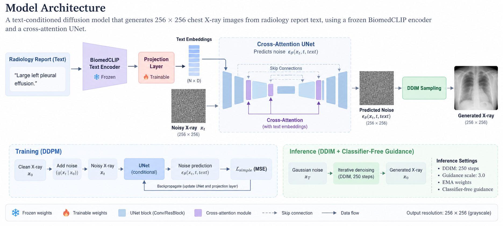

# Text-Conditional Diffusion for Chest X-Ray Synthesis

A text-conditioned diffusion model that generates **256×256 chest X-rays** from radiology report text. The model uses a **frozen BiomedCLIP text encoder**, a trainable projection layer, and a **cross-attention UNet**, with support for **DDIM sampling**, **classifier-free guidance (CFG)**, and **EMA weights**.

## Highlights

- Trained from scratch on **3,465 frontal IU-XRay images**
- Trained for **120 epochs in ~2.5 hours on a single NVIDIA H200**
- Achieved **FID 32.99** and **KID 0.02542 ± 0.00413** using standard 2048-d Inception features
- Verified that text conditioning affects generation using **fixed-noise ablations across 5 seeds**
- Supports **automatic checkpointing and resume** for time-limited GPU jobs

---

## Model Architecture



The BiomedCLIP text tower stays frozen; the projection layer that maps its token-level
output into the UNet's cross-attention dimension is the only trainable part of the text
path, and is updated together with the UNet. Diffusion runs over 1000 timesteps with a
cosine β schedule, and pad tokens are masked out of cross-attention. During training the
caption is dropped for 10% of samples, which is what gives classifier-free guidance an
unconditional branch to interpolate against at inference time.

---

## Results

### Distribution Metrics

| Metric | Value |
|---|---:|
| **FID** | **32.99** |
| **KID** | **0.02542 ± 0.00413** |
| SSIM | 0.6081 |
| PSNR | 13.93 dB |

Evaluation uses **2,000 generated samples** conditioned on held-out report text and **3,851 real frontal X-rays**, with standard **2048-d Inception features**, **DDIM 250 steps**, **guidance scale 3.0**, and **EMA weights**. Full configuration is saved in `results/eval_fid_kid.json`.

FID and KID are the primary metrics. SSIM and PSNR are reported at epoch 120 for completeness and vary substantially between epochs — see [Why PSNR / SSIM Are Secondary](#why-psnr--ssim-are-secondary).

### Comparison with Published Results

Published IU-XRay results include **Diff-CXR (31.46)**, **LLM-CXR (41.29)**, and **RoentGen (73.32)**. These models were trained on **MIMIC-CXR (~377K images)** and evaluated zero-shot on IU-XRay, while this model was trained directly on IU-XRay and evaluated against a reference set that includes its training distribution.

---

## Text Conditioning Ablation

To verify that the model actually uses the text condition, the initial noise is fixed by keeping the random seed constant. With the same seed, changing the caption is therefore the only input change.

A same-caption control reproduces the output **pixel for pixel**, so differences between the samples below come from the text conditioning path.

| Normal report | Normal report |
|---|---|
|  |  |
|  |  |

**Top:** *"The heart is normal in size. The lungs are clear."*  
**Bottom:** *"Large left pleural effusion."*

Across **5 seeds**, the two caption groups produce clearly different outputs. Normal reports generally produce well-formed frontal chest films with clearer lung fields, while the pathological caption produces denser and less stable structures.

> This experiment shows that the conditioning path is active and strongly influences the output. It does **not** prove that the model renders a named pathology correctly. Rare pathological captions are underrepresented in IU-XRay, so semantic accuracy and overall image quality remain confounded.

---

## Ground Truth vs. Generated

The following examples are taken from the **epoch-120 validation batch**. Each generated image is conditioned on the same report as its paired ground-truth image, but the model never receives the ground-truth image itself.


Image quality is uneven. A common failure mode is a globally plausible chest X-ray with **anatomically incoherent local structure**, especially for rare pathological reports.

---

## Training Behavior


Training and validation loss remain at a similar scale without clear divergence. The run begins to **plateau around epoch 57**. Extending the cosine schedule from 30 to 120 epochs moves the plateau later but does not improve the final endpoint.

A flat denoising loss does not necessarily mean sample quality has converged: uniform-timestep MSE is heavily influenced by high-noise timesteps and can saturate before perceptual quality stops changing. For this reason, **FID and KID are used as the primary quality metrics**.

### Why PSNR / SSIM Are Secondary


PSNR and SSIM are computed against the ground-truth image paired with the same report, using a fixed 8-image validation batch with fresh noise each epoch. They are reported only as rough diagnostics because generated samples are **not pixel-aligned reconstructions** of the ground truth.

In this run:

- SSIM changes substantially between consecutive epochs: **0.5010 at epoch 119 → 0.6081 at epoch 120**
- PSNR remains low (**10.4–13.9**)
- Published SSIM values for this task vary widely across implementations and evaluation protocols

The model is expected to generate **a plausible chest X-ray matching the report**, not reproduce the exact reference image pixel by pixel.

---

## Known Limitations

- **Small training set:** 3,465 images is far below the scale typically used for 256×256 pixel-space diffusion.
- **No real-vs-real FID floor yet:** the current FID lacks a dataset-size baseline showing the minimum achievable score under this evaluation protocol.
- **Rare pathology coverage is weak:** pathological captions are sparse in IU-XRay, and generation quality decreases for less frequent descriptions.
- **No radiological validation:** the outputs have not been evaluated for clinical correctness and **must not be used diagnostically**.
- A more scalable next step would be to fine-tune a **pretrained latent diffusion model** rather than train a pixel-space model from scratch.

---

## Setup

### Requirements

- NVIDIA GPU with CUDA support (**16 GB+ VRAM recommended**)
- CUDA Toolkit (**12.1 recommended**)
- Python **3.12**

### Install Dependencies

Install [`uv`](https://docs.astral.sh/uv/):

```bash
curl -LsSf https://astral.sh/uv/install.sh | sh
export PATH="$HOME/.local/bin:$PATH"
```

Create and activate the environment:

```bash
uv venv .venv --python 3.12
source .venv/bin/activate
uv pip install -r requirements.txt
```

In future shell sessions:

```bash
source .venv/bin/activate
```

`open_clip_torch` is installed from PyPI. Token-level text outputs are enabled at runtime with:

```python
model.text.output_tokens = True
```

No modification of the `open_clip` source is required.

---

## Dataset

Download the **Indiana University Chest X-ray Collection (IU-XRay)** from [Open-i](https://openi.nlm.nih.gov/faq).

Both the **PNG images** and **radiology reports** are required.

Expected directory structure:

```text
data/
└── IU-XRay/
    ├── NLMCXR_png/
    └── ecgen-radiology/
```

---

## Training

Edit the hyperparameters in the `Config` class in `config.py`, then run:

```bash
python3 train.py
```

### Training Features

- **Auto-resume:** rerunning `train.py` resumes from the latest checkpoint in `results/checkpoints/`
- **Time-limited jobs:** training stops gracefully after `Config.max_train_hours` and saves progress automatically
- **Periodic checkpoints:** `model-latest.pt` is updated according to `Config.checkpoint_every_min`
- **TensorBoard logging:** training/validation curves and sample images are logged under `results/tensorboard`
- **Visualizations:** per-epoch ground-truth vs. generated comparisons are saved to `results/visualization/`

Start TensorBoard with:

```bash
tensorboard --logdir results/tensorboard
```

---

## Inference

Generate an image from a text description:

```bash
python inference.py \
    --checkpoint </path/to/checkpoint.pt> \
    --caption "<caption>" \
    --output  \
    --n_steps <n_steps> \
    --guidance_scale <scale> \
    --seed <seed> \
    --batch_size <batch_size>
```

Key options:

- `--n_steps`: fewer than 1000 steps uses **DDIM sampling**; default is 250
- `--n_steps 1000`: runs full DDPM sampling
- `--guidance_scale`: controls classifier-free guidance; default is 3.0, while 1.0 disables guidance
- EMA weights are used automatically when available in the checkpoint

---

## Evaluation

Run FID / KID evaluation with:

```bash
python evaluate.py \
    --checkpoint </path/to/checkpoint.pt> \
    --n-samples <n> \
    --batch-size <batch_size> \
    --n-steps <n_steps> \
    --guidance-scale <scale> \
    --reference-split {train,val,all} \
    --caption-split {train,val,all} \
    --features 2048 \
    --save-samples results/eval-samples
```

By default, generated samples use captions from the **validation split** and are compared against the largest available real-image reference set.

The script prints FID / KID and stores the full run configuration in:

```text
results/eval_fid_kid.json
```

### Evaluation Notes

- `--split-ratio` must match the value used during training
- **2048-d Inception features** are the standard setting for FID comparisons; scores from other feature dimensions land on entirely different scales and must not be compared against them
- `--save-samples` caches generated images so metrics can be recomputed without repeating sampling
- With 2,000 generated samples, the result should be described as **FID-2k**, not compared directly with FID-50k values
- At this dataset size, **KID is generally more stable than FID**
- Sampling cost scales roughly with `n_samples × n_steps`

---

## Disclaimer

This project is for **research and educational purposes only**. Generated chest X-rays have not been clinically validated and must not be used for diagnosis or medical decision-making.
