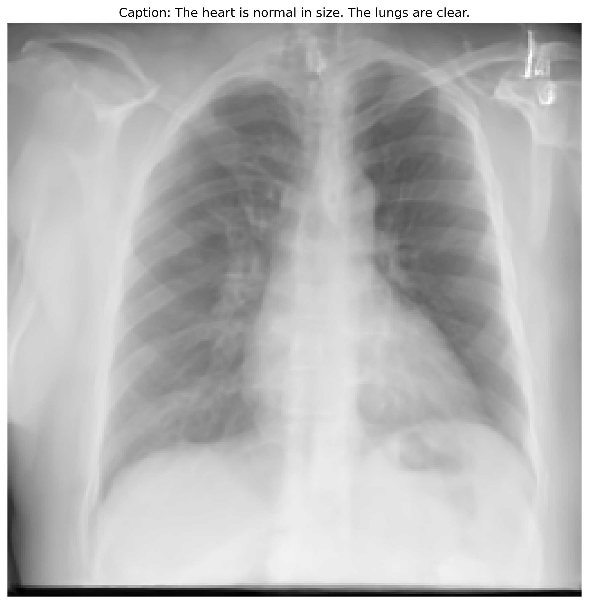
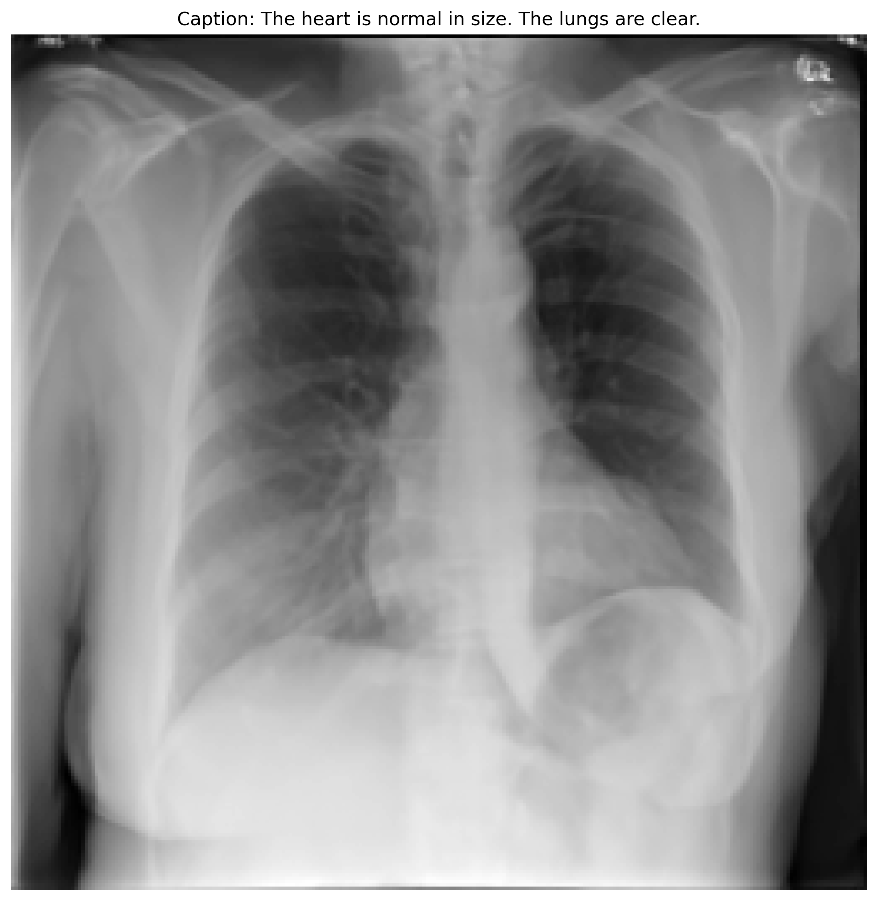
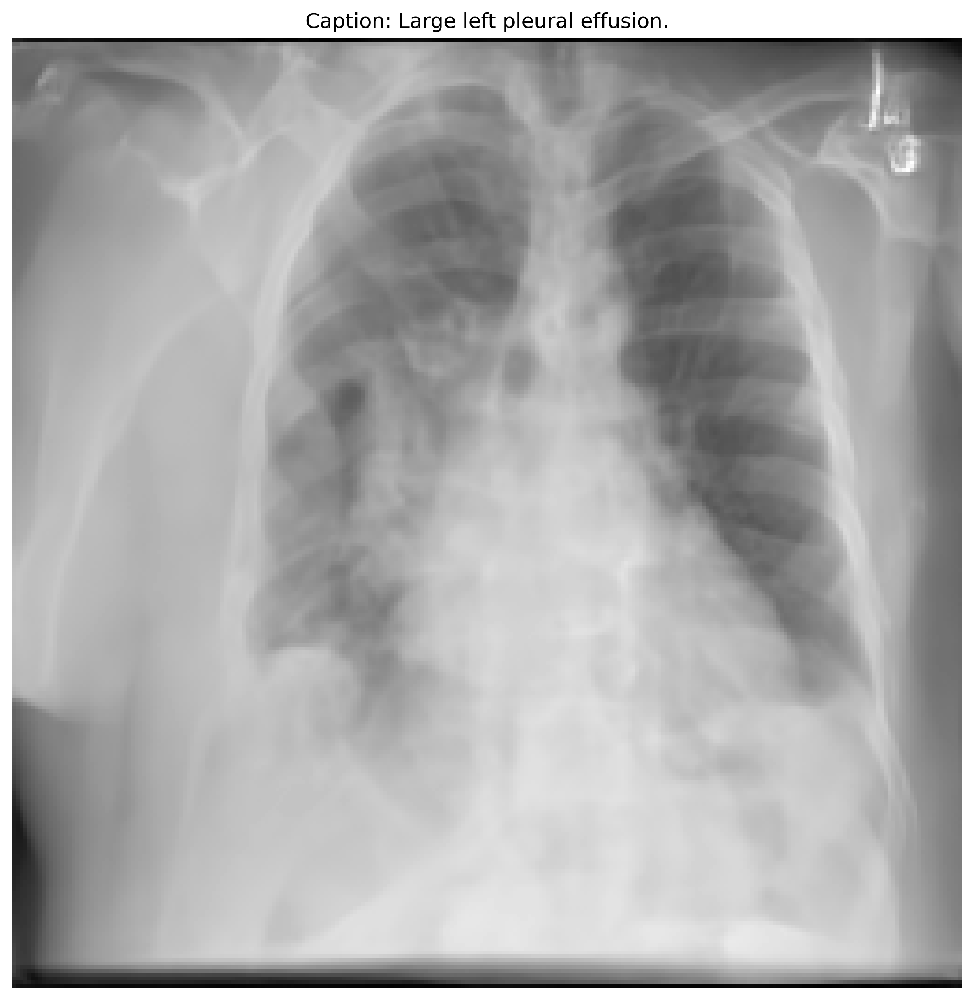
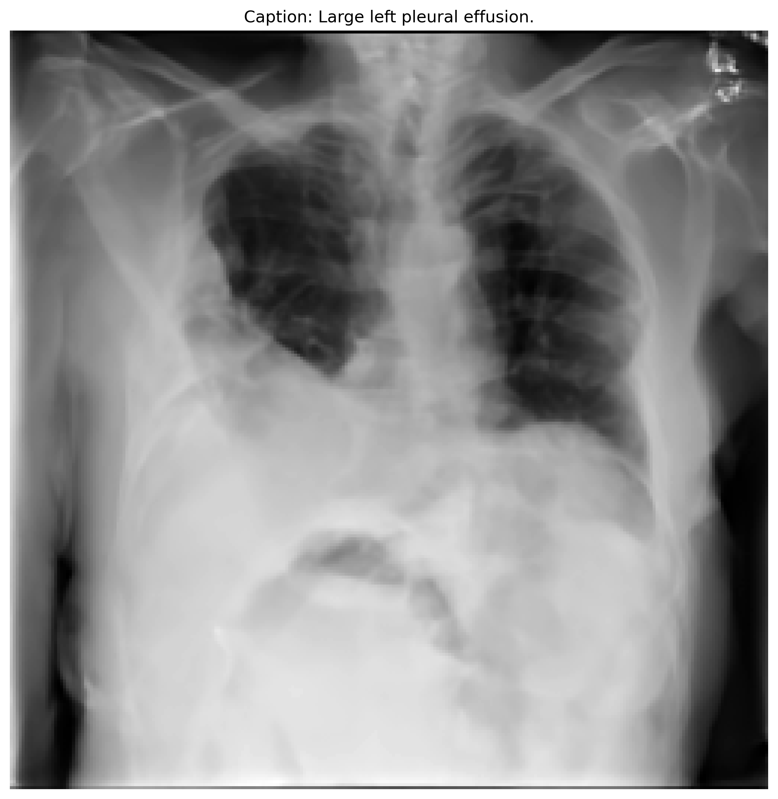
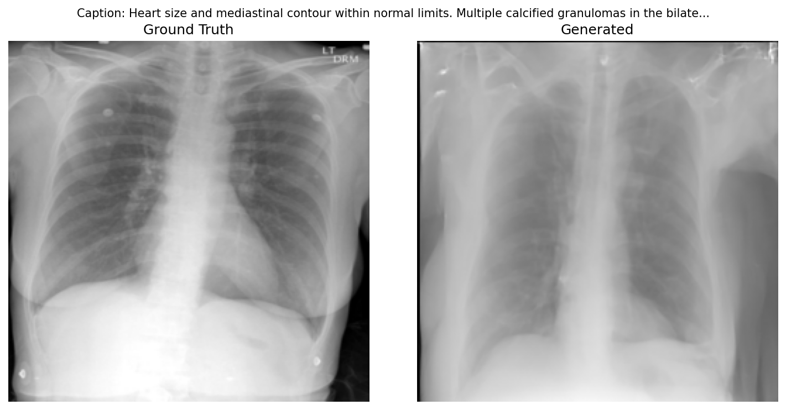
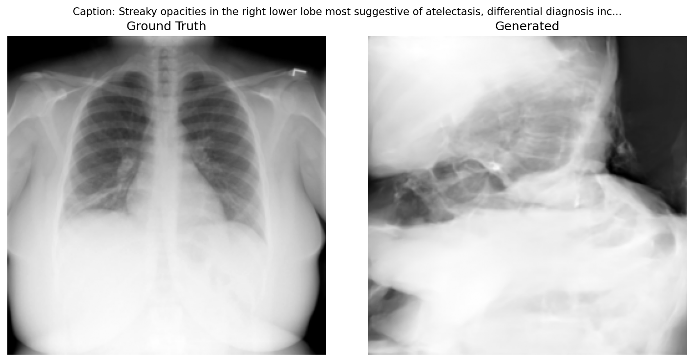
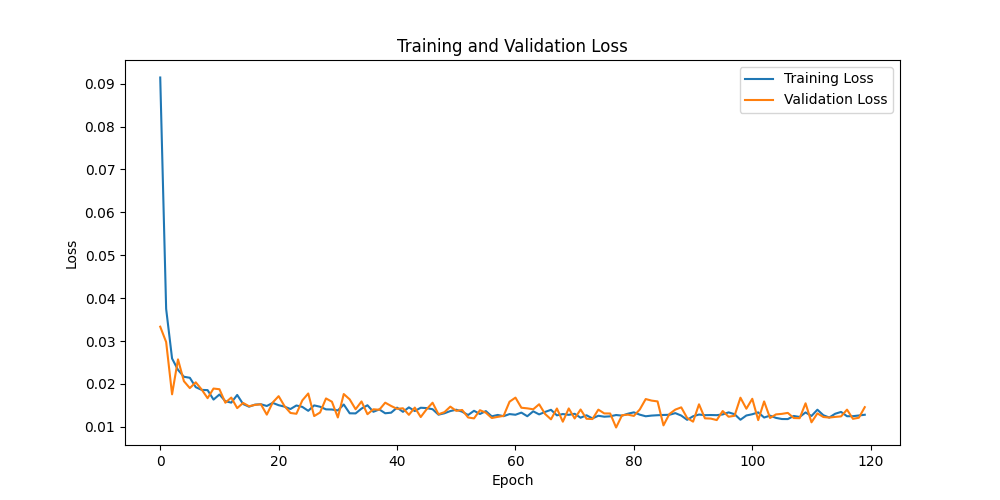
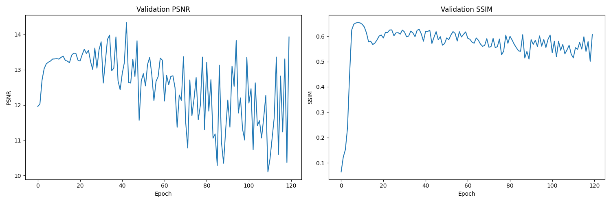

# Conditional DDPM for Text-to-Medical-Image Synthesis

Text-conditional DDPM that generates 256x256 chest X-ray images from radiology report text, using a frozen BiomedCLIP text encoder with a trainable projection and a cross-attention UNet. Supports DDIM sampling, classifier-free guidance, and EMA weights.

## Results

Trained from scratch on 3,465 frontal chest X-rays (IU-XRay), 120 epochs, ~2.5 h on
a single H200.

### Distribution metrics

| Inception features | FID | KID |
|---|---|---|
| **2048 (standard)** | **32.99** | 0.02542 ± 0.00413 |
| 768 | 0.1372 | 0.000259 ± 0.0000323 |

2,000 generated samples conditioned on held-out report text, against 3,851 real
frontal X-rays. DDIM 250 steps, guidance scale 3.0, EMA weights.
Full configuration in `results/eval_fid_kid.json`.

> **Read the feature dimension.** FID values are only comparable at the same
> Inception layer. The standard is the final 2048-d pooling layer; the 768-d
> pre-aux layer sits on a completely different scale — on the same pair of image
> sets, 2048-d scores 81.8 where 768-d scores 0.49. Both are reported here so the
> number cannot be quoted out of context.

> **On comparing to published numbers.** The best published FID on IU-XRay is
> Diff-CXR at 31.46, with LLM-CXR at 41.29 and RoentGen at 73.32. Those models are
> trained on MIMIC-CXR (377K images) and evaluated *zero-shot* on IU-XRay; this
> model is trained on IU-XRay and evaluated against a reference set that includes
> its training images. Matching a distribution you trained on is a fundamentally
> easier task than transferring to an unseen one, so 32.99 is **not** evidence of
> parity. It is a well-specified number for this setup, nothing more.

### Text conditioning is verified, not assumed

Fixing the seed fixes the initial noise, so the caption is the only variable.
A same-caption control run reproduces its output **pixel for pixel**, which puts the
noise floor at zero: any difference below is attributable to the text alone.

| | |
|---|---|
|  |  |
|  |  |

Top: *"The heart is normal in size. The lungs are clear."*
Bottom: *"Large left pleural effusion."*

Across 5 seeds the two groups do not overlap: normal reports produce upright,
well-formed frontal films with clear lung fields; pathological reports produce
denser, structurally degraded images.

**What this does and does not show.** It shows the conditioning path is live and
strongly influences output. It does **not** show the model renders a named pathology
correctly — semantics and image quality are confounded here, since normal findings
dominate IU-XRay and rare pathological captions fall in a sparse region of the
learned distribution.

### Ground truth vs. generated





Each pair shares a report; the model never sees the ground-truth image.

### Training



Train and validation loss stay at the same magnitude with no divergence — not
overfitting — but the run **plateaus around epoch 57**. Extending the cosine
schedule from 30 to 120 epochs moved the plateau later without improving the
endpoint. Note that a flat denoising loss does not imply sample quality has
converged: the uniform-*t* MSE is dominated by high-noise timesteps and saturates
early, which is why distribution metrics are the ones reported above.

### Why pixel metrics are not the headline



PSNR and SSIM are computed against the ground-truth image for the same report,
on a fixed 8-image validation batch with fresh noise each epoch. Three things make
them unusable as a quality signal here:

1. **Variance matches the signal.** SSIM moves 0.107 between consecutive epochs
   (0.5010 at epoch 119, 0.6081 at epoch 120). Published work separates methods on
   this dataset by margins of the same size.
2. **SSIM is mid-range while PSNR is low** (10.4–13.9, where 20+ is a passable
   reconstruction). Structure matches, pixels do not — the model produces *a* chest
   X-ray, not *that* chest X-ray.
3. **The literature disagrees with itself sixfold** on the same dataset and task:
   0.138 / 0.171 / 0.201 / 0.343 across StackGAN, AttnGAN, GAN-INT-CLS and XRayGAN,
   against 0.82 reported by one open-source reimplementation. A metric whose value
   is set by the evaluation protocol rather than by model quality cannot rank models.

Generated samples are not pixel-aligned with ground truth by construction, so these
are reported for transparency only.

### Known limitations

- No baseline yet for either metric: neither a real-vs-real FID floor (which bounds
  how low FID can go at this sample size) nor a before/after against the earlier
  training run. Without them, 32.99 has no reference point.
- 3,465 images is two to three orders of magnitude below what pixel-space 256²
  diffusion is normally trained on. The identified bottleneck is the training regime,
  not the implementation; the standard fix is fine-tuning a pretrained latent
  diffusion model rather than training from scratch.
- Pathological captions are sparse in IU-XRay, so the conditional distribution's tail
  is not learned.
- No radiological validation of any kind. Generated images are for research only and
  must not be used diagnostically.

## 0. Prerequisites

* NVIDIA GPU with CUDA support (recommended: at least 16GB VRAM)
* CUDA Toolkit (12.1 recommended)
* Python 3.12

## 1. Environment Setup

1. Install [uv](https://docs.astral.sh/uv/) (no root required)

    ```
    curl -LsSf https://astral.sh/uv/install.sh | sh
    export PATH="$HOME/.local/bin:$PATH"
    ```

2. Create a virtual environment and install dependencies

    ```
    uv venv .venv --python 3.12
    source .venv/bin/activate
    uv pip install -r requirements.txt
    ```

    `open_clip_torch` is installed from PyPI. The text encoder enables token-level outputs at runtime (`model.text.output_tokens = True`), so no modification of the open_clip source is needed.

3. In every new shell session, activate the environment before running anything:

    ```
    source .venv/bin/activate
    ```

## 2. Dataset Download
  * Access the Indiana University Chest X-ray Collection from [Open-i](https://openi.nlm.nih.gov/faq).
  * For this project, you must use both the `PNG images` and `Reports` of the dataset.
  * Organize the data with following directory structure:

    ```
    data/
      /IU-XRay
        /NLMCXR_png
        /ecgen-radiology
    ```

## 3. Training

1. Navigate to `config.py` and modify the hyperparameters in the `Config` class based on your settings (shared by `train.py` and `inference.py`).
2. Start the training process with the following command

   ```python3 train.py```

Notes:

* **Auto-resume**: rerunning `train.py` automatically resumes from the latest checkpoint in `results/checkpoints/` (`model-latest.pt` or the newest `model-epoch-N.pt`).
* **Time-limited GPU sessions**: training stops gracefully after `Config.max_train_hours` (default 7.5h, fitting an 8h GPU allocation) and checkpoints `model-latest.pt` every `Config.checkpoint_every_min` (default 30 min). Just rerun `train.py` in the next session to continue. Only the newest `Config.keep_checkpoints` per-epoch checkpoints are kept on disk.
* **Monitoring**: training/validation curves and sample images are logged to TensorBoard (`tensorboard --logdir results/tensorboard`); per-epoch GT-vs-generated comparisons are saved under `results/visualization/`.

## 4. Inference

Generate medical images from text descriptions:

```
python inference.py --checkpoint </path/to/checkpoint.pt> \
    --caption "<caption>" \
    --output  \
    --n_steps <n_steps> \
    --guidance_scale <scale> \
    --seed <seed> \
    --batch_size <batch_size>
```

* `--n_steps` below the training timesteps (1000) uses DDIM sampling (default 250); 1000 runs full DDPM.
* `--guidance_scale` controls classifier-free guidance strength (default 3.0; 1.0 disables guidance).
* Sampling uses EMA weights when present in the checkpoint.

## 5. Evaluation (FID / KID)

Per-epoch PSNR/SSIM only tracks a rough trend: generated samples are not pixel-aligned
with ground truth, and SSIM saturates within a few epochs. Distribution metrics are the
real measure of sample quality.

```
python evaluate.py --checkpoint </path/to/checkpoint.pt> \
    --n-samples <n> \
    --batch-size <batch_size> \
    --n-steps <n_steps> \
    --guidance-scale <scale> \
    --reference-split {train,val,all} \
    --caption-split {train,val,all} \
    --features 2048 768 \
    --save-samples results/eval-samples
```

Samples `--n-samples` images conditioned on captions from `--caption-split` (default
`val`, i.e. unseen reports) and compares them against the real images in
`--reference-split` (default `all`, for the largest possible reference). Prints FID and
KID (mean ± std) and writes them with the full run configuration to
`results/eval_fid_kid.json`.

* `--split-ratio` must match the value used at training time, or `val` is not actually held out.
* `--features` scores at several Inception feature dims in one sampling pass. **2048 is the
  standard FID reported in the literature; smaller dims are on a completely different scale
  and are not comparable to it** (on the same images, 2048 gave FID 81.8 where 768 gave 0.49).
  Smaller dims are only useful as a relative signal when the reference set is tiny.
* `--save-samples` caches the generated images so metrics can be recomputed at other feature
  dims without repeating the sampling pass, which dominates the runtime.
* `--n-samples` should be at least the largest feature dim, or the covariance FID estimates is
  rank-deficient. The default job uses 2000 against a 3,851-image reference set; report that as
  FID-2k rather than comparing it to FID-50k numbers.
* KID's subset size is clamped to the smaller of the two distributions; it is more
  reliable than FID at this dataset's scale (~3.8k frontal images).
* Sampling dominates the runtime: `n_samples × n_steps` UNet forward passes.
